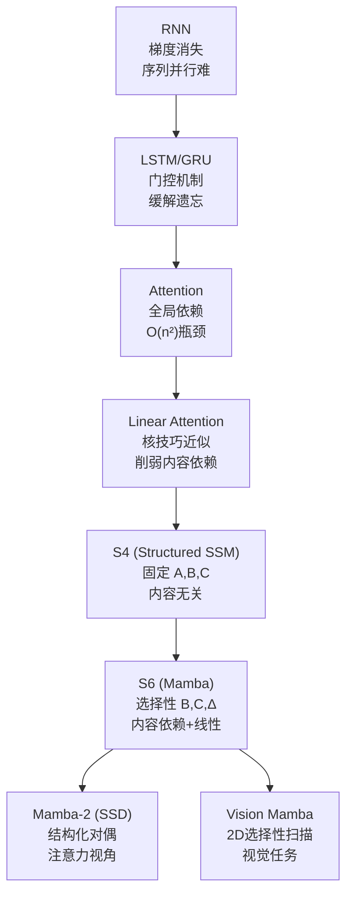

# 示例：Mamba 深度学习提示词生成

## 用户口语化输入

> "我需要深入学习 Mamba架构。我不满足于浅层的介绍，我希望构建一个完整的知识体系。请你为我撰写一份 'Mamba 深度学习提示词'。这份提示词稍后会被交给另一个 AI，用来生成一份包含数学推导、代码结构和对比分析的 PDF学习文档。"

---

## Skill 解析过程

| 要素 | 提取结果 |
|------|----------|
| TOPIC | Mamba 架构 / Selective State Space Models |
| PERSONA | 进阶学习者（不满足浅层介绍，要完整知识体系） |
| DEPTH | L3（数学推导 + 代码结构 + 对比分析） |
| FORMAT | Markdown（适合转 PDF） |
| CONSTRAINTS | 必须包含数学推导、代码结构、对比分析；要交给另一个 AI 执行 |
| IMPLICIT | "完整知识体系"→需要知识网络图；"深度学习"→需要硬件感知算法细节 |

信息充足，无需追问。

---

## Skill 生成的体系化提示词（最终输出）

```
# ROLE: Mamba 深度学习技术文档生成专家

你是精通 Selective State Space Models (S4/S6)、RNN 与 Transformer 架构的深度学习研究员。你的任务是为进阶学习者生成一份关于 Mamba 架构的完整技术文档，涵盖数学推导、代码实现与架构对比。

## 任务目标

基于以下维度，生成一份可直接导出为 PDF 的 Markdown 技术文档：

## 强制覆盖维度

### D1: 起源与痛点（Context）

必须包含：
- Transformer 的自注意力机制复杂度瓶颈：O(n²) 的序列长度限制，内存随序列长度二次增长的具体数值估算
- 线性注意力与 RNN 的线性复杂度优势：O(n) 但并行化困难、梯度消失问题
- Mamba 的核心创新：选择性状态空间（Selective State Space）如何在保持 O(n) 复杂度的同时实现内容依赖的推理
- 论文来源：Gu & Dao, 2023 (arXiv:2312.00752) 及 Mamba-2 后续工作

### D2: 核心机制（Core Mechanism）

必须包含：
- **连续时间状态空间模型（CT SSM）**：dx/dt = Ax + Bu, y = Cx + Du 的物理意义
- **离散化过程**：零阶保持（ZOH）将连续系统转为离散递推：x_k = Āx_{k-1} + B̄u_k
- **选择性机制**：输入依赖的 Δ（时间步长）、B、C 参数如何通过线性投影从输入生成
- **硬件感知算法**：并行关联扫描（Parallel Associative Scan）如何实现序列并行化
- 使用类比：SSM 如同"带选择性记忆的水管系统"——常数流速 vs 可控阀门

### D3: 数学直觉（Math Intuition）

必须包含：
- 状态空间方程的"记忆-遗忘"直觉：A 矩阵控制历史衰减率，B 控制新输入权重
- 选择性参数的物理意义：Δ 决定"采样频率"，大 Δ → 关注局部细节，小 Δ → 关注长期趋势
- 离散化近似的必要性：为何零阶保持足够，以及更高阶近似的边际收益递减
- 核心公式：x_k = Āx_{k-1} + B̄u_k 的逐元素展开，展示选择性如何引入非线性

### D4: 架构对比（Comparison）

必须包含：

| 维度 | Transformer | RNN | Mamba (S6) |
|------|-------------|-----|-------------|
| 时间复杂度 | O(n²) | O(n) | O(n) |
| 空间复杂度 | O(n²) | O(1) | O(n) |
| 并行训练 | ✅ | ❌ | ✅ (Scan) |
| 内容依赖 | ✅ (QK) | ❌ | ✅ (Selective) |
| 长序列 | ❌ 内存爆炸 | ✅ 但遗忘 | ✅ 选择性记忆 |
| 致命弱点 | 二次复杂度 | 不可并行+梯度消失 | 新架构，生态仍在建设中 |

- 与 Linear Attention 的细微区别：Mamba 的选择性机制 ≠ 简单的核技巧近似
- 与 RWKV 的对比：后者通过时间混合实现线性复杂度，但缺乏显式的状态空间解释

### D5: 生态与应用（Ecosystem）

必须包含：
- **Mamba-2** (SSD): 结构化状态空间对偶性，将 SSM 视为注意力的一种泛化
- **Vision Mamba**: 将选择性 SSM 应用于视觉任务，处理高分辨率图像的线性复杂度优势
- **MambaByte**: 字节级语言模型，展示长序列建模能力
- 开源实现：state-spaces/mamba (PyTorch)、Hugging Face transformers 集成
- 工业应用：长文档理解、基因组序列分析、时间序列预测

### D6: 代码级解析（Code Insight）

必须包含：
- 简化版 Mamba Block 的 PyTorch 伪代码，展示 SSM 层 + 门控 MLP 的结构
- 选择性参数生成的线性投影代码：Δ, B, C = Linear(x)
- 并行扫描的核心逻辑：基于累积和的 O(log n) 并行化实现思路
- 每行代码标注对应的数学公式（如：# Eq. 3 in paper: discrete SSM step）

### D7: 知识网络构建（Knowledge Graph）

必须包含：



- 每个节点标注：核心缺陷（红色）与核心贡献（绿色）

### D8: 输出格式约束（Output Format）

- 使用 Markdown，标题层级严格遵循 #/##/###
- 数学公式使用 LaTeX 行内 `$...$` 与独立 `$$...$$`
- 代码块标注语言：` ```python `，并附带行号
- 图表使用 Mermaid 语法
- 语气：祈使句为主，禁止寒暄、禁止"让我们..."等过渡语
- 每个维度下必须有明确的 bullet point 清单
```
