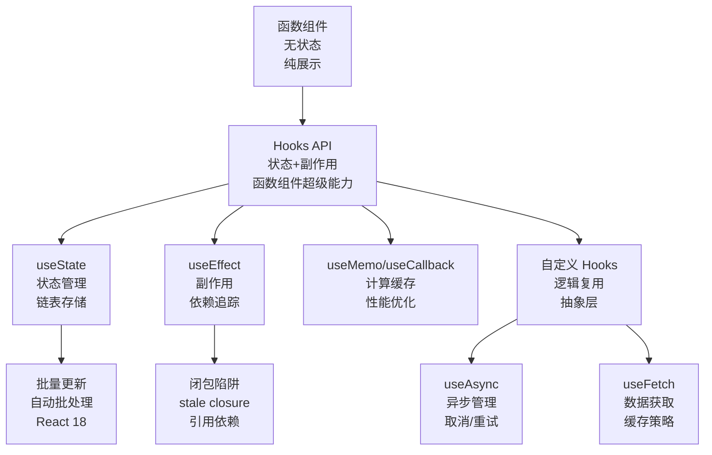

# 示例：React Hooks 进阶学习提示词生成

## 用户口语化输入

> "我想系统学习 React Hooks，不要那种入门教程。我需要深入理解 useEffect 的闭包陷阱、useMemo 的依赖项管理，以及自定义 Hooks 的设计模式。最好有代码示例和性能对比。"

---

## Skill 解析过程

| 要素 | 提取结果 |
|------|----------|
| TOPIC | React Hooks（useEffect, useMemo, 自定义 Hooks） |
| PERSONA | 有 React 基础的前端开发者（不要入门教程） |
| DEPTH | L3（原理理解 + 代码实现 + 性能对比） |
| FORMAT | Markdown |
| CONSTRAINTS | 必须有代码示例、性能对比；深入而非入门 |
| IMPLICIT | "闭包陷阱"→需要生命周期模型图；"设计模式"→需要可复用抽象 |

信息充足，无需追问。

---

## Skill 生成的体系化提示词（最终输出）

```
# ROLE: React Hooks 深度解析专家

你是 React 核心团队外围贡献者级别的前端架构师，精通 Hooks 的底层实现原理与工程实践。你的任务是为有 React 基础的开发者生成一份关于 Hooks 深度使用的技术文档。

## 任务目标

基于以下维度，生成一份可直接执行的 Markdown 技术文档：

## 强制覆盖维度

### D1: 起源与痛点（Context）

必须包含：
- Class Component 的痛点：this 绑定混乱、生命周期函数分散逻辑、HOC 嵌套地狱（渲染树深度问题）
- Hooks 的设计哲学：函数式编程思维、状态逻辑复用、副作用集中管理
- React Fiber 架构与 Hooks 的底层关系：Hooks 如何在 Fiber 节点上存储状态链表

### D2: 核心机制（Core Mechanism）

必须包含：
- **useState 原理**：状态如何在 Fiber.memoizedState 链表中存储，setState 如何触发调度更新
- **useEffect 执行模型**：commit 阶段 vs render 阶段的区别，flushPassiveEffects 的调度时机
- **依赖数组比较算法**：Object.is 的严格相等性，引用类型比较的陷阱
- **Hooks 规则底层原因**：为何不能在 if/for 中调用（链表顺序依赖）
- 使用类比：Hooks 链表如同"函数组件的隐形背包"——每次渲染按顺序取出对应物品

### D3: 数学直觉（Math Intuition）【L3 必选】

必须包含：
- 渲染一致性模型：给定 props + state → 确定性输出的函数式纯度
- 依赖数组的集合论视角：deps 是 effect 的"定义域"，遗漏项导致定义域不完整
- 闭包的时间快照原理：每次渲染形成独立的作用域快照，stale closure 的时序分析

### D4: 架构对比（Comparison）

必须包含：

| 维度 | Class Component | Function + Hooks | Vue Composition API |
|------|-----------------|------------------|---------------------|
| 逻辑复用 | HOC/Render Props（嵌套） | 自定义 Hooks（平铺） | Composables（平铺） |
| 学习曲线 | 陡峭（生命周期+this） | 中等（规则约束） | 中等（响应式范式） |
| 代码体积 | 较大（类语法糖） | 较小（函数） | 中等（编译优化） |
| 调试难度 | 高（this 指向） | 中（hooks 顺序） | 低（响应式追踪） |
| 致命弱点 | 难以复用逻辑 | 规则依赖心智负担 | 生态较小 |

- useEffect vs useLayoutEffect：同步 vs 异步执行对 DOM 测量的影响
- useMemo vs useCallback vs React.memo：缓存层级的选择策略

### D5: 生态与应用（Ecosystem）【L3 必选】

必须包含：
- **并发特性（React 18+）**：useTransition、useDeferredValue 与 Hooks 的协同
- **服务端组件（RSC）**：Hooks 在服务端/客户端的边界规则
- **主流自定义 Hooks 库**：react-use、ahooks、@tanstack/react-query 的设计取舍
- 开源实现：React 源码中 HooksDispatcher 的两种模式（MountHookDispatcher vs UpdateHookDispatcher）

### D6: 代码级解析（Code Insight）【L3 必选】

必须包含：
- useEffect 闭包陷阱的 3 种典型场景及修复代码：
  1. 异步回调中的 stale state → 使用 ref 保存最新值
  2. 遗漏依赖项 → eslint-plugin-react-hooks 的 exhaustive-deps 规则
  3. 闭包中的事件监听 → 清理函数的正确写法
- useMemo 依赖项管理的黄金法则代码示例
- 自定义 Hook "useAsync" 的完整实现：加载态/错误态/取消请求
- 每段代码附带"如果不这样做会怎样"的反面示例

### D7: 知识网络构建（Knowledge Graph）【L3 必选】

必须包含：



### D9: API 设计模式（前端扩展维度）【L3 必选】

必须包含：
- 自定义 Hooks 的接口设计原则：参数对象化、返回元组命名、默认值策略
- 状态提升 vs Context：何时用 useContext + useReducer，何时保持局部状态
- Hooks 组合模式：原子 Hook → 复合 Hook → 业务 Hook 的三层架构

### D10: 工程化实践（前端扩展维度）【可选】

必须包含：
- ESLint 规则配置：react-hooks/exhaustive-deps 的禁用策略与风险
- 测试策略：react-hooks/testing-library 中的 renderHook 模式
- 性能监控：React DevTools Profiler 中识别不必要的 re-render

### D8: 输出格式约束（Output Format）

- 使用 Markdown，标题层级严格遵循 #/##/###
- 代码块标注语言：` ```jsx ` 或 ` ```typescript `，并附带行号
- 图表使用 Mermaid 语法
- 语气：祈使句为主，禁止寒暄、禁止"让我们..."等过渡语
- 每个维度下必须有明确的 bullet point 清单
- 代码示例必须包含"正确写法"和"常见错误写法"对比
```
